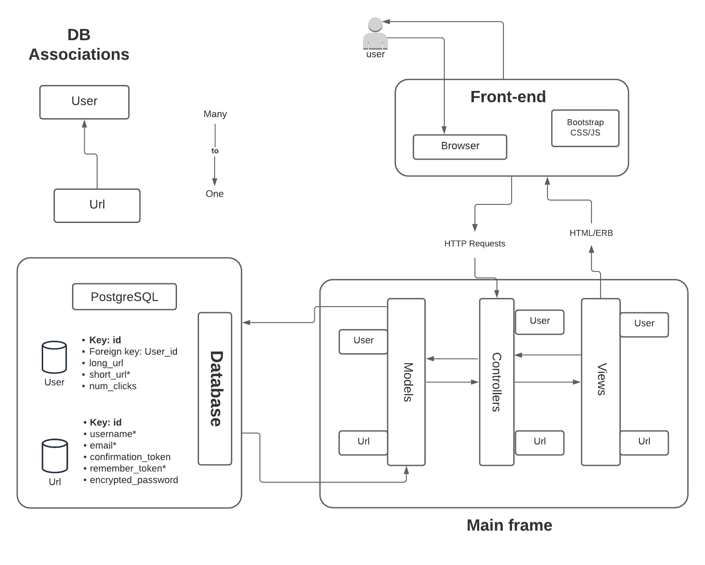

# URL-Shortener

[Link to Heroku](https://mysterious-depths-24936.herokuapp.com/)

# How to use

Access `/` and sign-in or sign-up. The app will direct user to user's main page
* To look at all saved links: Click on "All links". The original link, shortened, and number of clicks are displayed. User can also follow links or delete unwanted ones
* To add a new link: 
    1. From user homepage, click on "Add a new link" 
    2. Type in your long url you want to shorten
    3. Click "Save URL": POST to `/urls`
    4. Copy your short link for future use or you can find it from "All links"
* To retrive your long link from a shortened link
    1. From user homepage, fill in your shortened link on "Search for" and click "Search". <strong>Note:</strong> User can input just the 8 letters code or the full shortened link (`abcd1234` or `https://shtnr/abcd1234` both work)
    2. Re-add short link if unavailable or be redirected to a page with the long link
    3. Click "Follow the link" or go back if the link is wrong

# Database/schema & infrastructure
<strong>Run on PostgreSQL</strong>

<strong>Index on</strong>
* urls at short_url
* users at email, username, remember_token

# Encoding algorithm
Short_url is created by generating a random 8-long characters string and saved to the database with the original long_url. Long_url is retrieved by querying the database with the short_url. The query performance is enhanced with an index on short_url

# Features
## User authentication
User authentication system (`gem clearance`) allows for secured access of one's own link. Saving, retriving, deleting links are completely independent between users.
* Basic sign in, sign out
* Remember user session using cookies
* Allow user to reset password using email

## User Interface
Using Bootstrap

## Export URLs as CSV
On "All links" page (`/urls`), user can download a csv version of their urls on button "Download CSV"

# Scalibility and future development
Current encoding algorithm is sufficient for an app for user keeping record of their shortened links. However, problem arises with querying a full database everytime we look for a link when our app grows bigger with tens of thousands of urls. We need a different encoding algorithm: that is to encode url id to the 8 letters code with a bijective function

### Proposed encoding algorithm
Short_url is `[a-z0-9A-Z]` containing 62 letters. We would convert from url_id (base 10) to short_url (base 62) and vice versa. This is the problem of converting between bases (similar problem: binary to/from decimal). The biggest base 10 we can get is `(61*62^7 + 61*62^6 + ... + 61*62^0`) 2.18E+14 should be sufficient

Assuming mathematic calculations don't take significant time, encoding and retrival has complexity of O(1) which is amazing!
### Future addition
For now the app is only tested by running the main functionalities on local and Heroku. If I had more time, I would add automated testing with rspec
